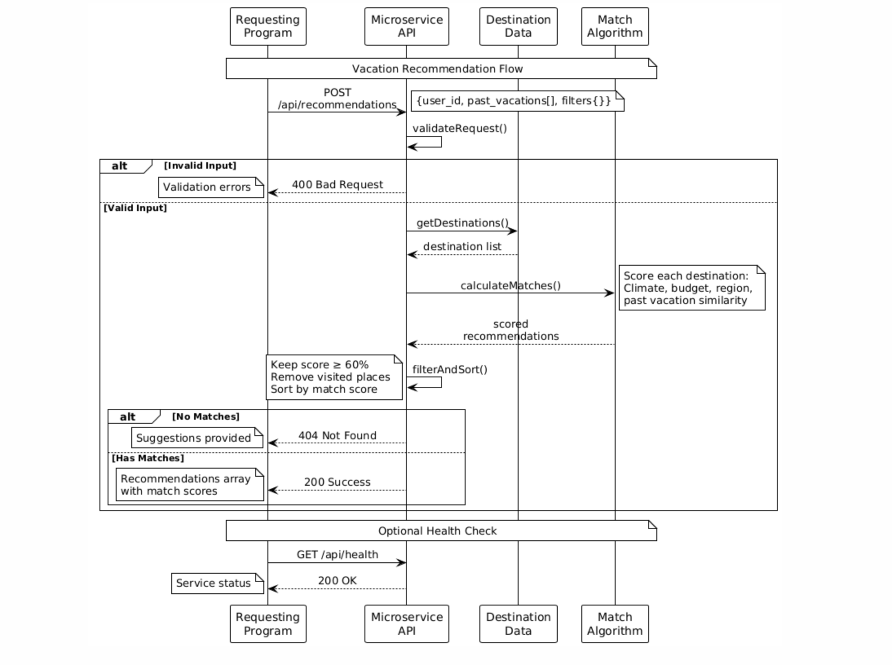

# Vacation Recommendation Microservice - Abhigya Khanal

## Communication Contract

This microservice provides personalized vacation recommendations based on user travel history and preferences. It analyzes past vacation patterns and applies user-specified filters to suggest relevant destinations using **Node.js Express** with comprehensive error handling.

---

## How to REQUEST Data from the Microservice

### Primary Endpoint
```
POST http://localhost:3000/api/recommendations
```

### Additional Endpoints
```
GET http://localhost:3000/api/health - Health check
GET http://localhost:3000/api/destinations - Browse available destinations
```

### Headers
```
Content-Type: application/json
```

### Required Request Parameters

| Parameter | Type | Required | Description |
|-----------|------|----------|-------------|
| `userId` | string | YES | Unique identifier for the user requesting recommendations |
| `pastVacations` | array of strings | YES | List of previously visited destinations (e.g., ["Rome, Italy", "Tokyo, Japan"]) |
| `filters` | object | YES | User preferences for filtering recommendations |
| `filters.climate` | string | NO | Preferred climate: "warm", "cold", "temperate", or "any" (default: "any") |
| `filters.budget` | string | NO | Budget range: "low", "medium", "high", or "any" (default: "any") |
| `filters.region` | string | NO | Preferred regions, comma-separated: "Asia", "Europe", "Africa", "Americas", or "any" (default: "any") |

### Example Request Code

**Python (using requests):**
```python
import requests
import json

# Prepare request data
recommendation_request = {
    "userId": "abh431",
    "pastVacations": [
        "Rome, Italy",
        "Kyoto, Japan",
        "Bangkok, Thailand"
    ],
    "filters": {
        "climate": "warm",
        "budget": "medium",
        "region": "Asia, Africa"
    }
}

# Send POST request
response = requests.post(
    "http://localhost:3000/api/recommendations",
    json=recommendation_request,
    headers={"Content-Type": "application/json"}
)
```

**JavaScript/Node.js (using axios):**
```javascript
const axios = require('axios');

const recommendationRequest = {
    userId: "abh431",
    pastVacations: [
        "Rome, Italy", 
        "Kyoto, Japan",
        "Bangkok, Thailand"
    ],
    filters: {
        climate: "warm",
        budget: "medium", 
        region: "Asia, Africa"
    }
};

const response = await axios.post(
    'http://localhost:3000/api/recommendations',
    recommendationRequest,
    { headers: { 'Content-Type': 'application/json' } }
);
```

**cURL:**
```bash
curl -X POST http://localhost:3000/api/recommendations \
  -H "Content-Type: application/json" \
  -d '{
    "userId": "abh431",
    "pastVacations": ["Rome, Italy", "Kyoto, Japan", "Bangkok, Thailand"],
    "filters": {
      "climate": "warm",
      "budget": "medium",
      "region": "Asia, Africa"
    }
  }'
```

---

## How to RECEIVE Data from the Microservice

### Success Response (200 OK)

The microservice returns a JSON object with the following structure:

```json
{
    "status": "success",
    "userId": "abh431",
    "totalRecommendations": 2,
    "recommendations": [
        {
            "id": 1,
            "name": "Seychelles, Africa",
            "image": "https://images.example.com/seychelles.jpg",
            "description": "Pristine tropical beaches with crystal-clear waters...",
            "tags": ["warm", "medium", "Africa", "beaches", "tropical"],
            "climate": "warm",
            "budget": "high",
            "region": "Africa",
            "matchScore": "95%",
            "estimatedBudget": "$2500-3500",
            "bestTimeToVisit": "April-October",
            "similarTo": ["Thailand beaches", "tropical destinations"],
            "activities": ["beaches", "snorkeling", "diving", "luxury resorts"]
        }
    ],
    "basedOnPattern": "Asian cultural and adventure destinations",
    "filters": {
        "climate": "warm",
        "budget": "medium",
        "region": "Asia, Africa"
    },
    "generatedAt": "2025-01-28T10:30:00Z",
    "responseTimeMs": 245.67
}
```

### Error Responses

**400 Bad Request - Invalid Input:**
```json
{
    "status": "error",
    "message": "Invalid input format",
    "details": "userId is required and must be a string",
    "userId": null,
    "timestamp": "2025-01-28T10:30:00Z"
}
```

**404 Not Found - No Matches:**
```json
{
    "status": "error",
    "message": "No destinations found matching your criteria. Try expanding your region preferences or adjusting your budget range.",
    "suggestions": [
        "Consider expanding your region preferences to include more areas",
        "Try 'medium' or 'high' budget range for more luxury options",
        "Consider 'temperate' climate for more variety"
    ],
    "userId": "abh431",
    "timestamp": "2025-01-28T10:30:00Z"
}
```

**500 Internal Server Error:**
```json
{
    "status": "error",
    "message": "Internal server error",
    "details": "[error details]",
    "userId": "abh431",
    "timestamp": "2025-01-28T10:30:00Z"
}
```

### Example Response Handling Code

**Python:**
```python
# Handle the response
if response.status_code == 200:
    data = response.json()
    print(f"Received {data['totalRecommendations']} recommendations")
    
    for recommendation in data['recommendations']:
        print(f"- {recommendation['name']} (Match: {recommendation['matchScore']})")
        print(f"  Budget: {recommendation['estimatedBudget']}")
        print(f"  Description: {recommendation['description'][:80]}...")
        
elif response.status_code == 400:
    error = response.json()
    print(f"Input Error: {error['message']}")
    print(f"Details: {error['details']}")
    
elif response.status_code == 404:
    error = response.json()
    print(f"No matches: {error['message']}")
    if 'suggestions' in error:
        print("Suggestions:")
        for suggestion in error['suggestions']:
            print(f"  - {suggestion}")

elif response.status_code == 500:
    error = response.json()
    print(f"Server Error: {error['message']}")
```

**JavaScript/Node.js:**
```javascript
// Handle the response
try {
    const response = await axios.post(url, data);
    
    if (response.status === 200) {
        const data = response.data;
        console.log(`Received ${data.totalRecommendations} recommendations`);
        
        data.recommendations.forEach(rec => {
            console.log(`- ${rec.name} (Match: ${rec.matchScore})`);
            console.log(`  Budget: ${rec.estimatedBudget}`);
            console.log(`  Description: ${rec.description.substring(0, 80)}...`);
        });
    }
} catch (error) {
    if (error.response?.status === 400) {
        const errorData = error.response.data;
        console.log(`Input Error: ${errorData.message}`);
        console.log(`Details: ${errorData.details}`);
    } else if (error.response?.status === 404) {
        const errorData = error.response.data;
        console.log(`No matches: ${errorData.message}`);
        if (errorData.suggestions) {
            console.log('Suggestions:');
            errorData.suggestions.forEach(suggestion => {
                console.log(`  - ${suggestion}`);
            });
        }
    } else if (error.response?.status === 500) {
        console.log(`Server Error: ${error.response.data.message}`);
    }
}
```

---

## Health Check Endpoint

### Request
```
GET http://localhost:3000/api/health
```

### Response
```json
{
    "status": "healthy",
    "service": "vacation-recommendation-microservice",
    "version": "1.0.0",
    "timestamp": "2025-01-28T10:30:00Z",
    "uptime": 3600
}
```

### Browse Destinations Endpoint

### Request
```
GET http://localhost:3000/api/destinations
GET http://localhost:3000/api/destinations?region=Asia&budget=low&climate=warm
```

### Response
```json
{
    "status": "success",
    "total": 2,
    "destinations": [
        {
            "id": 2,
            "name": "Chiang Mai, Thailand",
            "climate": "warm",
            "budget": "low",
            "region": "Asia",
            "description": "Cultural hub with ancient temples...",
            "estimatedBudget": "$1200-2000",
            "activities": ["temples", "markets", "cooking classes"]
        },
        {
            "id": 5,
            "name": "Bali, Indonesia",
            "climate": "warm",
            "budget": "low", 
            "region": "Asia",
            "description": "Tropical paradise with beautiful beaches...",
            "estimatedBudget": "$1000-2000",
            "activities": ["beaches", "temples", "rice terraces"]
        }
    ]
}
```

---

## Performance Specifications

- **Response Time:** < 500ms for recommendation generation
- **Match Threshold:** Minimum 60% match score required
- **Recommendation Limit:** Up to 10 destinations per request
- **Scalability:** Handles users with 50+ past destinations efficiently

---

## UML Sequence Diagram

The following sequence diagram shows the complete request/response flow:


---

## Getting Started

1. **Install dependencies:**
   ```bash
   npm install
   ```

2. **Run the microservice:**
   ```bash
   npm start
   ```

3. **Test the service:**
   ```bash
   npm test
   ```

4. **Integrate** into your main program using the request/response patterns documented

---

